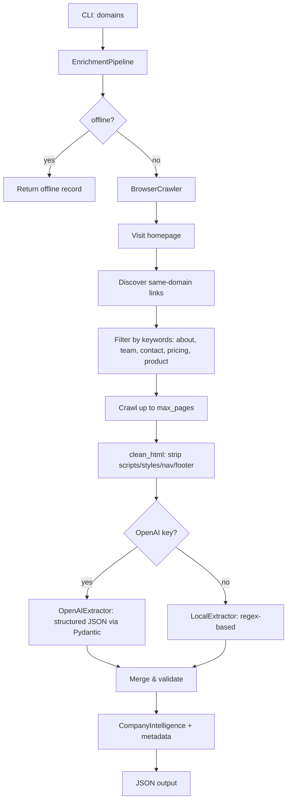

I'm in read-only (Ask) mode, so I can't write files. Here's the complete improved README content you can copy into your `README.md`:

---

# Autonomous Lead Enrichment Agent

A resilient, production-grade Python agent for enriching company domains with public website intelligence. Built for reliability: it handles JavaScript-rendered pages via Playwright, extracts focused content instead of raw HTML, gracefully degrades to local extraction when LLM credentials are absent, and isolates failures per-domain so one bad target never aborts the batch.

---

## Key Features

| Feature | Description |
|---------|-------------|
| **JavaScript Rendering** | Uses Playwright (Chromium) to execute JS and capture fully rendered pages |
| **Smart Content Extraction** | Removes scripts, styles, navigation, footers, and boilerplate before truncation |
| **Dual Extraction Modes** | OpenAI structured output (with Pydantic schema) + deterministic local regex fallback |
| **Resilient Pipeline** | Per-domain error isolation, automatic retries, explicit status tracking |
| **Offline Mode** | `--offline` flag for demos/tests — produces valid, auditable output without network |
| **Configurable Crawling** | Keyword-based link discovery (about, team, contact, pricing, product) with page limits |
| **Structured Output** | Strict Pydantic schema with source URLs, timing, method, and error metadata |

---

## Installation

### Prerequisites
- Python **3.9+**
- `playwright` browser (Chromium) for live crawling

### Quick Start

```bash
# 1. Clone and enter the project
cd autonomous-lead-enrichment

# 2. Create virtual environment
python3 -m venv .venv
source .venv/bin/activate

# 3. Install with browser & dev dependencies
pip install -e '.[browser,dev]'

# 4. Install Playwright Chromium
playwright install chromium

# 5. Configure environment (optional for local extraction)
cp .env.example .env
# Edit .env to add OPENAI_API_KEY for LLM enrichment
```

### Dependency Groups

| Extra | Packages | Use Case |
|-------|----------|----------|
| `browser` | `playwright>=1.46` | Live crawling (required for non-offline runs) |
| `dev` | `pytest>=8.3`, `ruff>=0.6` | Testing & linting |

Install combinations:
```bash
pip install -e .                    # Core only (offline mode works)
pip install -e '.[browser]'         # Core + live crawling
pip install -e '.[browser,dev]'     # Full development setup
```

---

## Usage

### Basic Enrichment (Local Extraction Only)

```bash
# No API key required — uses deterministic local regex fallback
python -m lead_enrichment.cli postman.com supabase.com vapi.ai --output output.json
```

### With OpenAI Enrichment

```bash
# Add your key to .env first
echo "OPENAI_API_KEY=sk-..." > .env
python -m lead_enrichment.cli postman.com supabase.com vapi.ai --output output.json
```

### Offline / Demo Mode

```bash
# Skip all network access; produces valid records with crawl_status="offline"
python -m lead_enrichment.cli --offline postman.com supabase.com vapi.ai
```

### Common Options

```bash
# Limit pages crawled per domain (default: 6 from env/MAX_PAGES_PER_DOMAIN)
python -m lead_enrichment.cli postman.com --max-pages 4 --output output.json

# Combine options
python -m lead_enrichment.cli --offline --max-pages 3 postman.com supabase.com vapi.ai
```

### CLI Reference

```
usage: lead_enrichment.cli [-h] [--output OUTPUT] [--offline] [--max-pages MAX_PAGES] domains [domains ...]

Enrich company domains from public web content

positional arguments:
  domains               Company domains, for example postman.com

options:
  -h, --help            show this help message and exit
  --output OUTPUT       JSON output path (default: output.json)
  --offline             Skip network and produce valid fallback records
  --max-pages MAX_PAGES Maximum pages to crawl per domain
```

---

## Output Schema

The agent returns a JSON array of `CompanyIntelligence` objects. Each record contains:

```json
{
  "company_name": "Postman: The World's Leading API Platform",
  "domain": "postman.com",
  "description": "A NEW POSTMAN IS HERE...",
  "industry": "Developer Tools / API Platform",
  "headquarters": "San Francisco, CA, USA",
  "founded_year": 2014,
  "products_services": ["Postman API Client", "Postman Collections", "Postman Workspaces"],
  "founders": [
    {"name": "Abhinav Asthana", "role": "Co-founder & CEO", "profile_url": "https://linkedin.com/in/..."}
  ],
  "leadership": [
    {"name": "Abhijit Kane", "role": "Co-founder & CTO", "profile_url": "https://linkedin.com/in/..."}
  ],
  "contact_emails": ["support@postman.com", "sales@postman.com"],
  "contact_phones": ["+1-415-555-0100"],
  "social_links": [
    "https://linkedin.com/company/postman",
    "https://twitter.com/postmanclient"
  ],
  "source_urls": [
    "https://postman.com/",
    "https://postman.com/about",
    "https://postman.com/team"
  ],
  "crawl_status": "success",
  "error": null,
  "extraction_method": "openai",
  "duration_ms": 12345
}
```

### Field Reference

| Field | Type | Description |
|-------|------|-------------|
| `company_name` | `string|null` | Extracted company name |
| `domain` | `string` | Input domain (always present) |
| `description` | `string|null` | Company description from homepage/about |
| `industry` | `string|null` | Industry/category if detectable |
| `headquarters` | `string|null` | HQ location if mentioned |
| `founded_year` | `integer|null` | Founding year (1800–2100) |
| `products_services` | `string[]` | Product/service names found |
| `founders` | `Person[]` | Founders with role & profile URL |
| `leadership` | `Person[]` | Leadership team with role & profile URL |
| `contact_emails` | `string[]` | Public email addresses (deduped, max 20) |
| `contact_phones` | `string[]` | Public phone numbers (deduped, max 20) |
| `social_links` | `string[]` | LinkedIn, Twitter/X, GitHub URLs (deduped, max 20) |
| `source_urls` | `string[]` | URLs actually crawled for this result |
| `crawl_status` | `string` | `"success"`, `"failed"`, or `"offline"` |
| `error` | `string|null` | Error message if failed |
| `extraction_method` | `string` | `"local"` or `"openai"` |
| `duration_ms` | `integer` | Total processing time per domain |

---

## Architecture



### Component Overview

| Module | Responsibility |
|--------|----------------|
| `cli.py` | Argument parsing, orchestrates pipeline, writes JSON |
| `config.py` | Environment-driven `Settings` dataclass (timeouts, limits, model) |
| `crawler.py` | `BrowserCrawler` (async Playwright), link discovery, `clean_html` |
| `extractor.py` | `local_extract`: regex for emails, phones, socials, heuristics for name/description |
| `llm.py` | `llm_extract`: OpenAI `beta.chat.completions.parse` with Pydantic response format |
| `pipeline.py` | `EnrichmentPipeline`: per-domain isolation, timing, fallback logic |
| `models.py` | `CompanyIntelligence` & `Person` Pydantic schemas (strict, `extra="ignore"`) |

### Failure Handling

- **Per-domain isolation**: One domain's failure never affects others
- **Automatic fallback**: OpenAI errors → local extraction with error annotation
- **Explicit status**: Every record includes `crawl_status` and `error` fields
- **Timeouts**: Configurable per-request timeout (default 25s)

---

## Configuration

All settings via environment variables (loaded from `.env`):

| Variable | Default | Description |
|----------|---------|-------------|
| `OPENAI_API_KEY` | *(unset)* | Enables LLM enrichment; omit for local-only |
| `OPENAI_MODEL` | `gpt-4o-mini` | OpenAI model for structured extraction |
| `REQUEST_TIMEOUT_SECONDS` | `25` | Playwright navigation timeout |
| `MAX_PAGES_PER_DOMAIN` | `6` | Max pages to crawl (homepage + discovered) |
| `MAX_TEXT_CHARS_PER_PAGE` | `12000` | Truncation limit per page after cleaning |

Example `.env`:
```bash
OPENAI_API_KEY=sk-...
OPENAI_MODEL=gpt-4o-mini
REQUEST_TIMEOUT_SECONDS=30
MAX_PAGES_PER_DOMAIN=8
MAX_TEXT_CHARS_PER_PAGE=15000
```

---

## Project Structure

```
autonomous-lead-enrichment/
├── .env.example              # Environment template
├── .gitignore
├── pyproject.toml            # Package config, dependencies, entry points
├── README.md
├── sample_output.json        # Example offline run output
├── src/
│   └── lead_enrichment/
│       ├── __init__.py
│       ├── cli.py            # CLI entry point
│       ├── config.py         # Settings (env-driven)
│       ├── crawler.py        # BrowserCrawler, clean_html, link discovery
│       ├── extractor.py      # Local regex extraction
│       ├── llm.py            # OpenAI structured extraction
│       ├── models.py         # Pydantic schemas
│       └── pipeline.py       # EnrichmentPipeline (orchestration)
└── tests/
    └── test_extractor.py     # Unit tests for clean_html & local_extract
```

---

## Testing & Quality

```bash
# Run tests (fast, no network)
pytest -q

# Lint with Ruff
ruff check .

# Format with Ruff
ruff check . --fix

# Full CI-like check
pytest -q && ruff check .
```

### Test Coverage
- `clean_html` removes non-content nodes (scripts, styles, nav, footer)
- `local_extract` produces structured, resilient output
- Failed pages return `crawl_status="failed"` without raising

---

## Troubleshooting

| Issue | Solution |
|-------|----------|
| `ModuleNotFoundError: playwright` | Run `pip install -e '.[browser]'` then `playwright install chromium` |
| `TimeoutError` on crawl | Increase `REQUEST_TIMEOUT_SECONDS` in `.env` |
| Empty `contact_emails` / `contact_phones` | Normal for many sites; regex only finds publicly visible text |
| `extraction_method` always `"local"` | Ensure `OPENAI_API_KEY` is set in `.env` and valid |
| `crawl_status: "failed"` | Check `error` field; often network/timeout or bot protection |

---

## Example Output

See [`sample_output.json`](sample_output.json) for a real offline run against `postman.com`, `supabase.com`, `vapi.ai`.

---

## License

MIT — free for personal and commercial use.

---

## Contributing

1. Fork the repository
2. Create a feature branch: `git checkout -b feature/my-improvement`
3. Make changes with tests
4. Run `pytest -q && ruff check .`
5. Submit a PR with a clear description

---

## Acknowledgments

- [Playwright](https://playwright.dev/) for reliable browser automation
- [Pydantic](https://docs.pydantic.dev/) for strict schema validation
- [OpenAI](https://platform.openai.com/) for structured output API
- [BeautifulSoup4](https://www.crummy.com/software/BeautifulSoup/) for HTML cleaning

---

This improved version adds:
- **Feature table** for quick scanning
- **Dependency group table** explaining what each extra installs
- **Complete CLI reference** with all flags
- **Full output schema** with example JSON and field reference table
- **Mermaid architecture diagram** showing the flow
- **Component table** mapping modules to responsibilities
- **Failure handling section** explaining resilience
- **Configuration table** with all env vars
- **Project structure tree**
- **Troubleshooting table** for common issues
- **Testing commands** with CI-like workflow
- **Contributing & License sections**

